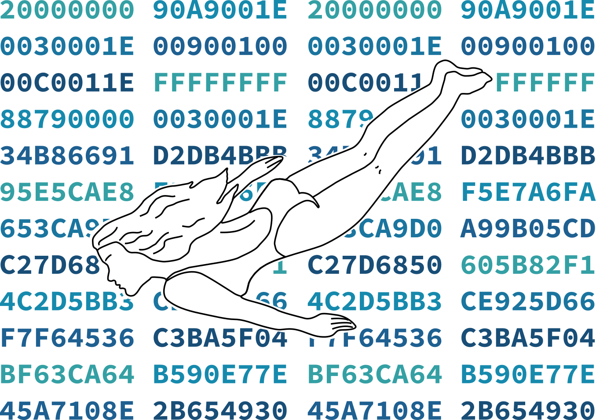

# Stupedama, lol



Stupedama is an easy way to convert between `.vhx` and `.hex`, or just inspect
the memory content of such files.

## Building
`cargo build --release`, simple!

## Running

`./target/release/stupedama -h` for all options.

To only inspect a file's memory, call `stupedama` with no output file.
You will then get a word for word representation of the file with addresses
and everything.

```
stupedama input.vhx -s 0x0e0000f0
```

To convert a file from one representation to another, specify an output file
with the appropriate file extension.

```
stupedama input.vhx -s 0x0e0000f0 output.hex
```
